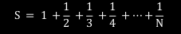
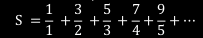
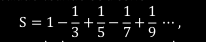
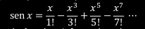
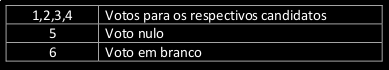

 # Exercícios de repetição
 
 Exercícios              | Enunciado
 ------------------------|----------------------------------------------------------------------------------------------------------------------------------------------------------------------------------------
 [Exercício 1](./01)     | Imprimir os números pares entre o intervalo N e M. Os valores M e N são informados na entrada, sendo inteiros, N < M e N >= 0.
 [Exercício 2](./02)     | Imprimir os termos de uma progressão aritmética de razão Q e primeiro e último termos iguais a 1 e N, respectivamente. N e Q são informados na entrada.
 [Exercício 3](./02)     | Ler N números reais e imprimir qual foi o maior e o menor número informado. A quantidade N de números a serem lidos é informada pelo usuário, sendo N o primeiro valor lido.
 [Exercício 4](./04)     | Faça um algoritmo que calcula e imprime a soma dos números entre N e M. N e M são informados na entrada, sendo inteiros, N < M e N >= 0.
 [Exercício 5](./05)     | Faça um algoritmo que calcula e imprime o produto dos números entre N e M. N e M são informados na entrada, sendo inteiros, N < M e N >= 0.
 [Exercício 6](./06)     | Ler N números inteiros e exibir a soma dos números. A quantidade N de números a serem lidos é informada pelo usuário, sendo N o primeiro valor lido.
 [Exercício 7](./07)     | Ler N números inteiros e exibir a soma dos números ímpares. A quantidade N de números a serem lidos é informada pelo usuário, sendo N o primeiro valor lido.
 [Exercício 8](./08)     | Ler N números inteiros e exibir a soma dos números divisíveis por 5. A quantidade N de números a serem lidos é informada pelo usuário, sendo N o primeiro valor lido.
 [Exercício 9](./09)     | Ler N números inteiros e exibir o produto dos números. A quantidade N de números a serem lidos é informada pelo usuário, sendo N o primeiro valor lido.
 [Exercício 10](./10)    | Ler números inteiros e calcular o produto dos números pares informados. O programa encerra quando informado 0.
 [Exercício 11](./11)    | Enquanto o valor -1 não for digitado, leia números fornecidos pelo usuário. No final, exiba quantos números foram digitados e quantas vezes o número 5 foi informado.
 [Exercício 12](./12)    | Faça um algoritmo para calcular e exibir a soma e a média das notas de N alunos fornecidas pelo usuário. Cada aluno possui 3 notas, sendo N o primeiro valor lido.
 [Exercício 13](./13)    | Um número primo é divisível somente por 1 e por ele mesmo. Faça um algoritmo para identificar se um determinado número fornecido pelo usuário é primo ou não. Exemplos de números primos: 2, 5, 7, 11, 13, … .Caso o número seja primo, imprima 1 e, caso não seja, imprima 0.
 [Exercício 14](./14)    | Faça um algoritmo que identifique a quantidade de números primos entre o intervalo de 1 até N. Com N sendo o primeiro valor lido e sendo maior ou igual a 1.
 [Exercício 15](./15)    | Faça um algoritmo que imprima a serie de Fibonacci até o valor N fornecido pelo usuário. A série de Fibonacci é mostrada abaixo.     1, 1, 2, 3, 5, 8, 13, 21, ... , N
 [Exercício 16](./16)    | Faça um algoritmo que imprima a soma da sequência apresentada abaixo, onde N é fornecido pelo usuário.   
 [Exercício 17](./17)    | Faça um algoritmo para determinar o valor de S dado pela série      onde o número de termos da série é fornecido pelo usuário.
 [Exercício 18](./18)    | O valor aproximado de 𝜋 pode ser calculado usando-se a série      sendo 𝜋 = S × 4. Faça um algoritmo para calcular e escrever o valor aproximado de 𝜋 com N termos, onde N é fornecido pelo usuário.
 [Exercício 19](./19)    | Faça um algoritmo que leia um número N e mostre na tela o fatorial desse valor. O fatorial de um número N é dado por   N! = 1 ⋅ 2 ⋅ 3 ⋅ … ⋅ (N − 1) ⋅ N
 [Exercício 20](./20)    | O seno de um ângulo 𝑥 em radianos pode aproximado pela série de Mac-Laurin abaixo, para 0 ≤ 𝑥 ≤ 2𝜋      Faça um algoritmo que calcule o seno do ângulo x informado pelo usuário, considerando a série de Mac-Laurin com N termos, onde N também é fornecido pelo usuário.
 [Exercício 21](./21)    | Em uma eleição presidencial existem quatro candidatos. Os votos são informados por meio de código. Os códigos utilizados são:          Faça um programa que calcule e mostre:       • o total de votos para cada candidato;       • o total de votos nulos;       • a porcentagem de votos em branco sobre o total de votos.        Para finalizar o conjunto de votos digitados, deve-se informar o código zero. Caso seja informado um código inválido, o programa deve mostrar uma mensagem “Voto inválido!”.
       

